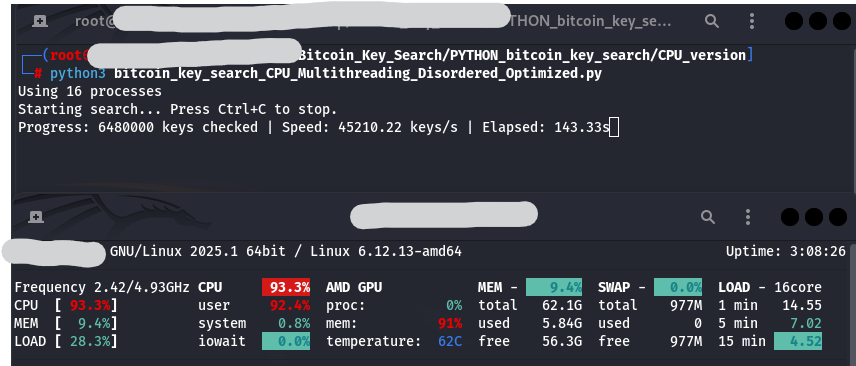
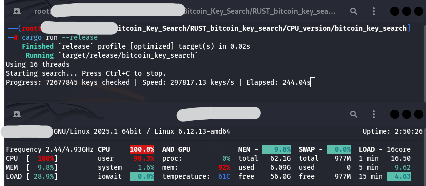

# Finding a needle in a haystack
Finding New Worlds！

This is a multi-threaded Bitcoin private key search program that uses CPU multi-threaded calculations to generate and verify random private keys, and searches in a random manner. This program can be used to test the collision probability of Bitcoin addresses or related research. (Note: Please try to run it on Linux. If you run it on Windows, the CPU temperature will be too high.)

## Python

## RUST(This version is recommended.)

# Instructions

## Install Necessary Packages
    pip install ecdsa base58

## Custom Section
Set the private key range and target address here.
    
    TARGET_ADDRESS = "1MVDYgVaSN6iKKEsbzRUAYFrYJadLYZvvZ"
    PRIVATE_KEY_MIN = 0x80000000000000000
    PRIVATE_KEY_MAX = 0xfffffffffffffffff

Set the number of processes per process.

    def search_private_key():
        """The main function that performs the private key search uses multi-process parallel processing."""
        start_time = time.time()  # Record program start time
        total_checked = 0
        num_processes = cpu_count()
        batch_size = num_processes * 500 # The number of keys to process in batches
        last_update_time = start_time  # Used to control updates per second

# Test
Below are a few known addresses and private keys that you can try to determine if the program is usable by searching in a narrow range.
When the private key corresponding to the target address is found, the program will automatically stop and generate a "found_key.txt" file locally, recording the target address, public key and private key.

    Address:1Pie8JkxBT6MGPz9Nvi3fsPkr2D8q3GBc1
    Private key:0000000000000000000000000000000000000000000000000000000000001460
    Private key range:0x1000:0x1fff

    Address:1BDyrQ6WoF8VN3g9SAS1iKZcPzFfnDVieY
    Private key:000000000000000000000000000000000000000000000000000000000000c936
    Private key range:0x8000:0xffff

    Address:1CfZWK1QTQE3eS9qn61dQjV89KDjZzfNcv
    Private key:00000000000000000000000000000000000000000000000000000000002de40f
    Private key range:0x200000:0x3fffff

# Thank you for your use
If this .py really helps you, could you give me some tokens to buy chips?

    XMR
    467uP2E4Q6KPAHgxcD9qjpDDJyuqLds6vS7SSwmGdxYLdqFqpzQiEdVEx3fUd7kfCCJKDTTSa8GShUbZyHARwWYcJNsnLGz
    
    USDT（ETH、ARB）
    0xA9baaDe9dB4B6AA2237BD46bd40bd7849De5D66b
    
    USDC（ETH、ARB）
    0xA9baaDe9dB4B6AA2237BD46bd40bd7849De5D66b

